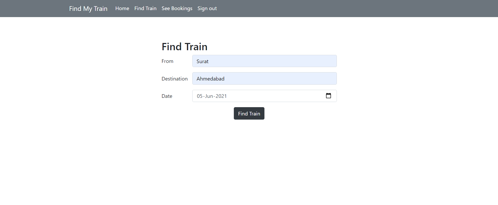

# **Online-Train-Ticket-Booking**
**Fastest way to book your train ticket!**

## **Do following things to run project on local computer.**
***

* `git clone https://github.com/Preetmungara/Online-Train-Ticket-Booking.git`

* `python manage.py migrate`

* `python manage.py createsuperuser`

* `python manage.py runserver`

* open http://127.0.0.1:8000/

## **That's it, Enjoy ! :smile:**

***

## **How is the project looks like** 
---

## **Login**

---

## **Login Successful**

---

## **Home Page**

---

## **Register Page**

---

## **Registration Successful**

---

## **Find Train**

---

## **List of Trains & Select Train**

---

## **Ticket Confirmation**

---

## **Ticket Details**

---

## **Cancel Ticket**

---

## **After Canceling Ticket**

---

## **After Logout**

